# Multi-purpose low-cost matrix display

[](#)
[](#)
[](#)

This project showcases a 32x8 pixel LED matrix display powered by an ESP32, designed for versatile applications such as clocks or smart home displays. Built on a budget of just $10, it uses 3D-printed parts and standard electronic components. Full source code and resources are provided to help you build it from scratch.


Example use cases:
| Clock with NTP sync | Solar production panel for home assistant |
| ------------------- | ------------------------------------------------- |
|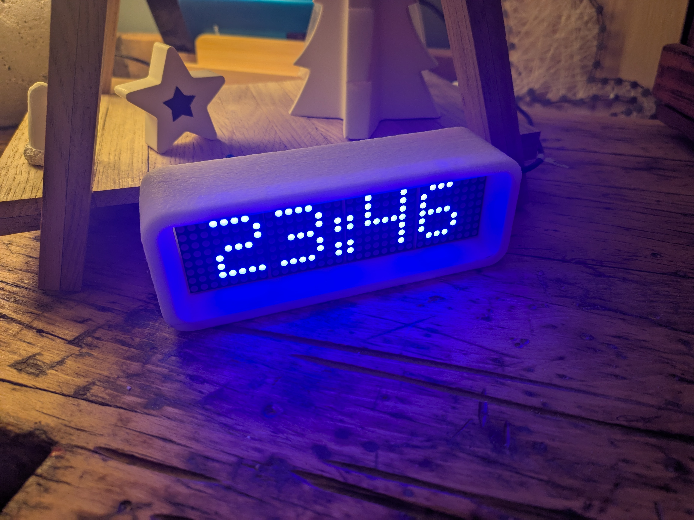|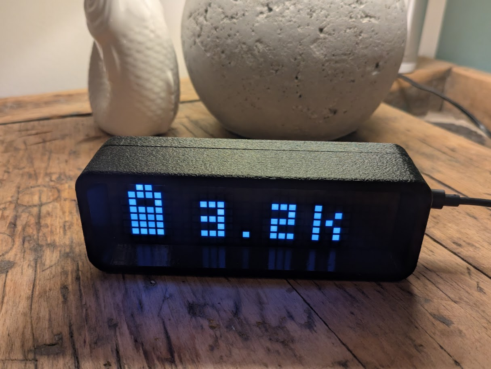|
| A standalone clock with an LED matrix display that automatically syncs time via NTP.<br><br>- Displays the current time in HH:MM format<br>- Customizable animations and dimming<br>- Automatic time synchronization using NTP | A multi-purpose Home Assistant display for various use cases, such as showing solar production and HEMS state.<br><br>- Home Assistant integration via ESPHome<br>- Displays arbitrary text<br>- Configurable parameters like fonts<br>- Integration with Home Assistant automation |
| [Go to Example](#clock-with-ntp-sync) | [Go to Example](#solar-production-control-panel-for-home-assistant) |


By experimenting with different filament colors, LED panels, and optional acrylic plates, you can create a variety of styles:
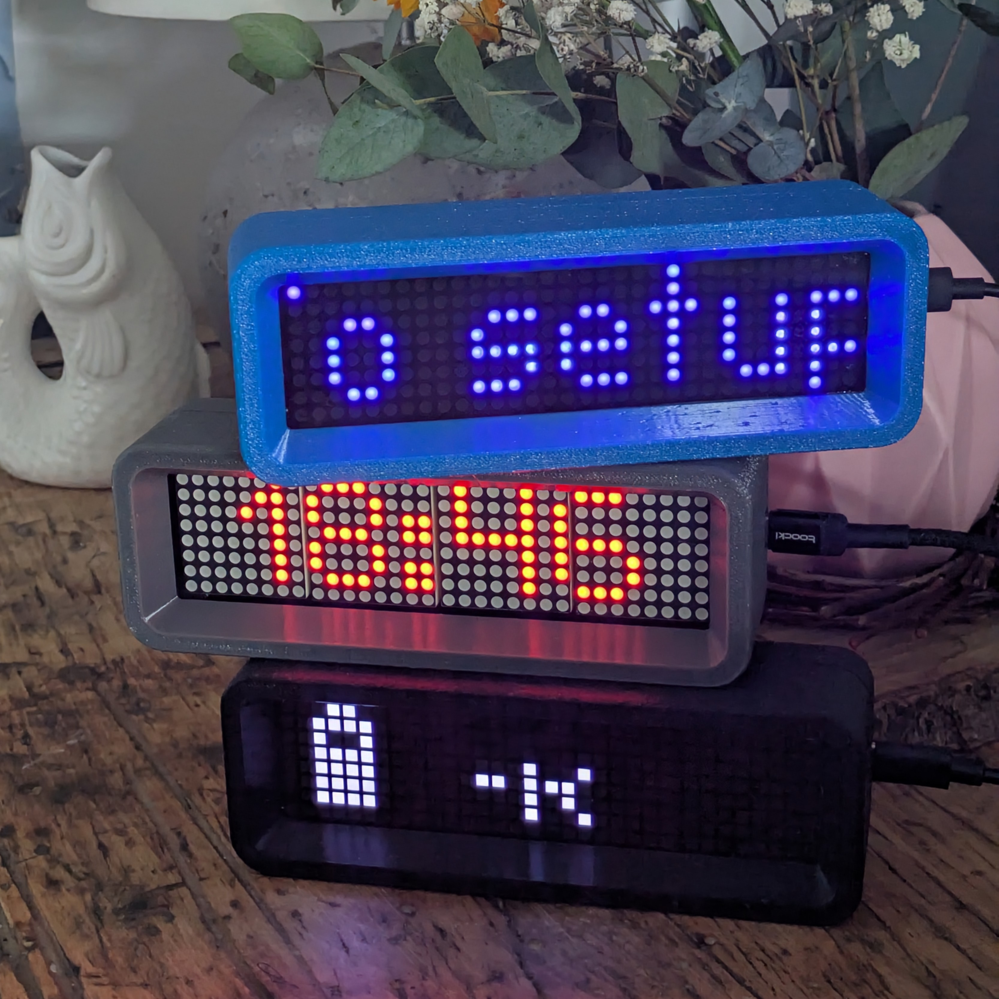


# Index
- [Mechanics](#Mechanics)
- [Electronics](#Electronics)
- [Usage: Clock with NTP sync](#clock-with-ntp-sync)
- [Usage: Generic home assistant display](#generic-home-assistant-display)
- [Usage: Solar production control panel for home assistant](#solar-production-control-panel-for-home-assistant)
- [Acknowledgements](#Acknowledgements)

## Mechanics

Renderings / Prototype:
| Front                                                | Back                                                 | Isometric |
| ---------------------------------------------------- | ---------------------------------------------------- | --------- |
| 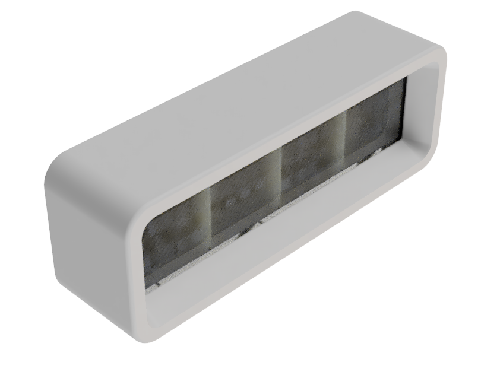 |    | 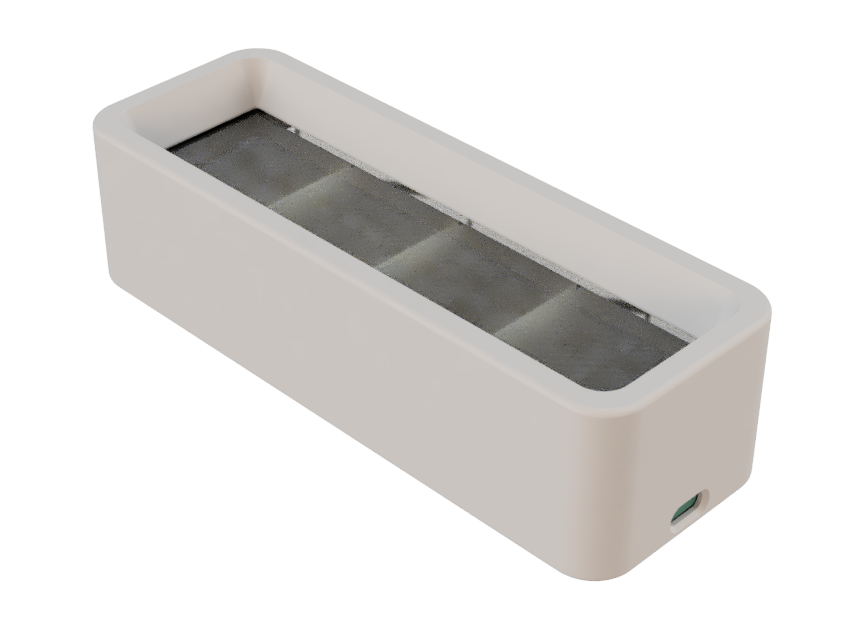 |
| 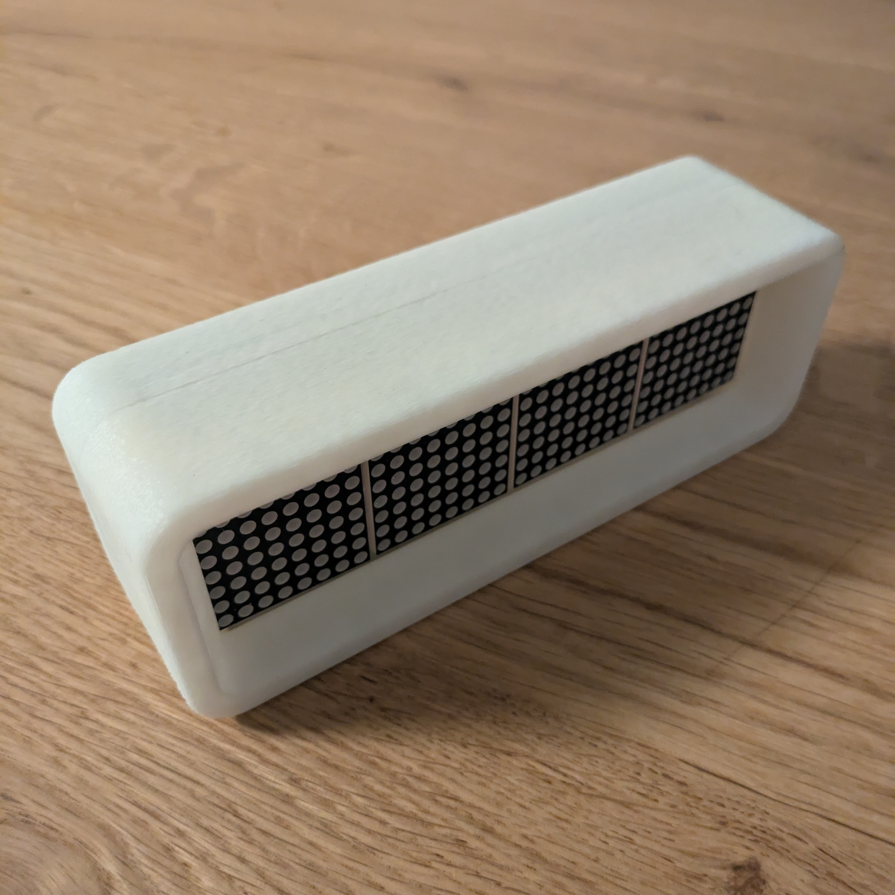 | 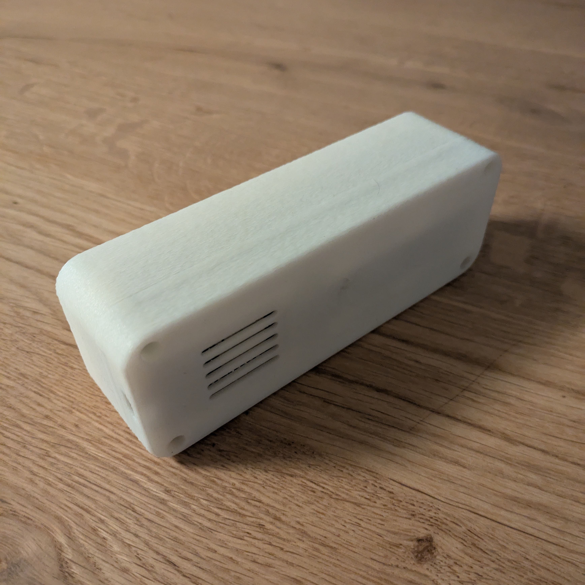   | 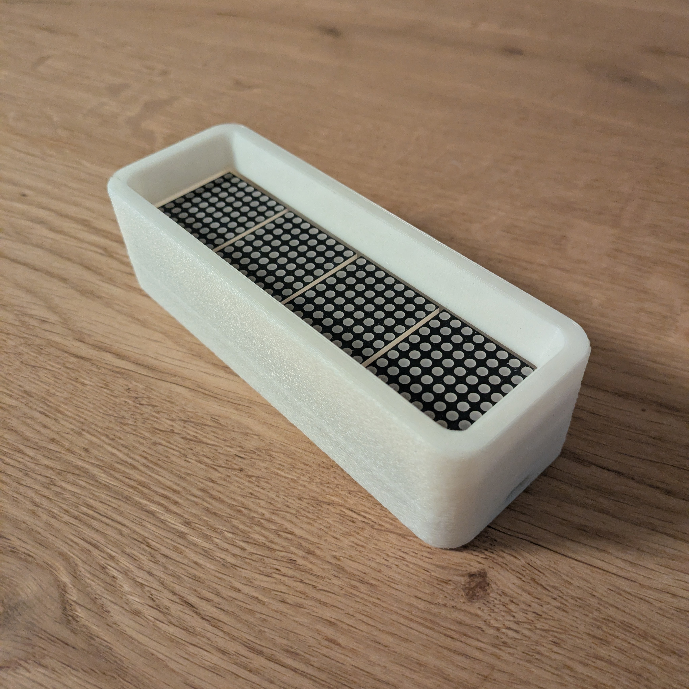 |


The housing consists of a front and back piece, with an optional acrylic plate for a cleaner look (look for the difference in the example photos).

### 3D-Printed Parts

| Filename                     | Thumbnail                                                                | Required | Notes |
| ---------------------------- | -------------------------------------------------------------------------| -------- | ------|
| `./stl/frontside.stl`      | 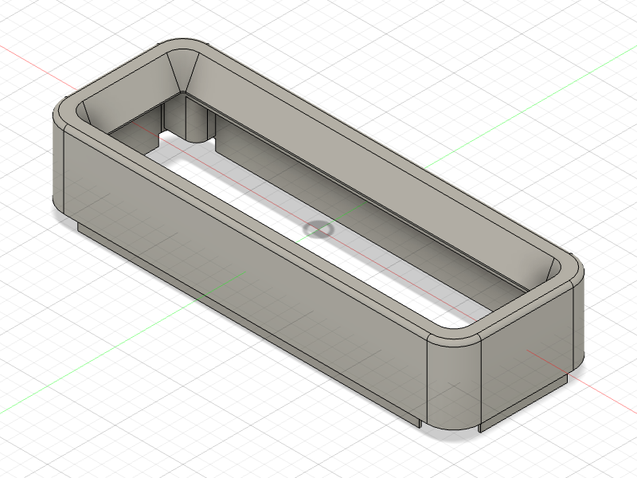 | 1        | |
| `./stl/backside.stl`       | 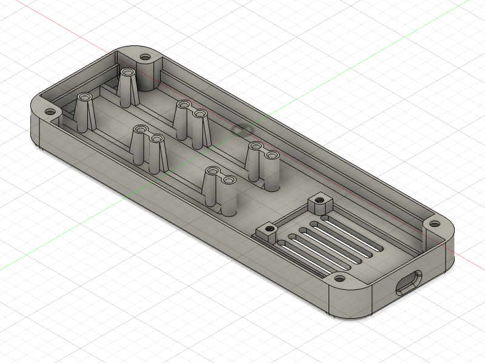   | 1        | |

Printer settings:
- Material: PETG
- Recommended orientation: Print the front piece upside down (front facing the print bed) to avoid supports. For a cleaner look, print it reversed with ironing enabled, but note that this requires more support material.
- Use "fuzzy skin" for a nice texture on the outside walls.
- No rafts or brims are required.

### Required parts

| Name              | Spec                           | Required | Notes |
| ----------------- | ------------------------------ | -------- | ------|
| countersunk screw | M3 5mm (e.g. DIN EN ISO 4762)  | 4        | To attach ESP to housing |
| countersunk screw | M3 5mm (e.g. DIN EN ISO 4762)  | 4        | To attach display to the housing |
| cylinder head screw | M3 10mm                      | 4        | To secure the front and back pieces |
| semi-transparent acrylic board | max 2mm, 140-150mm * 33-35mm | 1        | Optional, for a cleaner look |

### Assembly

- Attach all electronics to the back of the housing using screws.
- Glue the acrylic plate to the front (optional).
- Snap the front and back pieces together and secure them with screws.
- Use hot glue if needed to ensure everything stays in place.

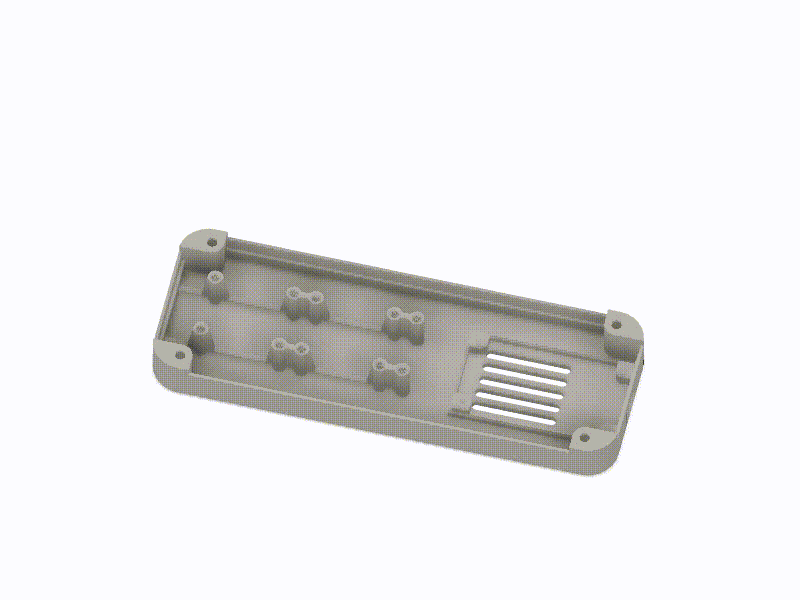


## Electronics

### Part list

| Unit price | Quantity | Partname                   | Example   | Notes |
| ---------- | -------- | -------------------------- | --------- | ----- |
| 5 USD      | 1        | ESP32 Dev module           | <a href="https://de.aliexpress.com/item/1005006474308440.html">AliExpress</a> | USB-C Version |
| 3 USD      | 1        | 4 digit 8x8 LED matrix display (MAX7219 FC16) | <a href="https://de.aliexpress.com/item/1005006976020684.html">AliExpress</a> |  |

Total cost: under 10 USD!


### Schematics

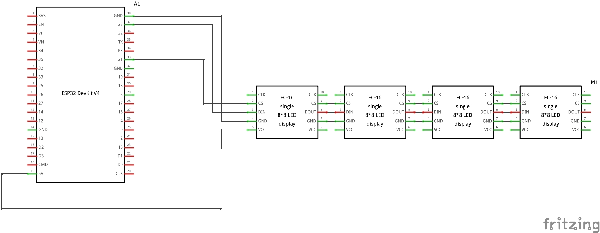


## Usage

The display can be used for various applications. Below are some examples:

### Clock with NTP sync

A simple standalone application that syncs time via NTP and displays it on the LED matrix

#### Prerequisites

- PlatformIO
- MD_Parola (via PIO)
- ESPDateTime (via PIO) 
- WiFiManager (via PIO)

#### Installation

1. Clone the repository:
   ```sh
   git clone https://github.com/smengerl/Matrix_Clock.git
2. Open the project in PlatformIO.
3. Wait for PlatformIO to download the required libraries.
4. Compile and upload the project to your ESP32.

#### Usage
- Power on the ESP32.
- On first use, connect to the ESP32's access point and configure your WiFi credentials.
- Wait for NTP synchronization.
- The current time will be displayed on the LED matrix.


### Generic home assistant display

This example integrates the display with Home Assistant using ESPHome.

#### Prerequisites

- home assistant
- ESP home

#### Installation

1. Register the ESP32 with ESPHome (e.g., via ESPHome Web).
2. Rename the device to matrix-display (so that `matrix-display.yaml` is the .yaml of your ESP home configuration for the device)
3. Copy the contents of [./ha_scripts](././ha_scripts) to the folder `[homeassistant]/config/esphome`, replacing `matrix-display.yaml`
4. Download the desired fonts and place them in the fonts subfolder. Fonts can be found at [1001fonts.com](https://www.1001fonts.com/pixel-fonts.html). Due to unclear licenses, I'm not sharing them here but you should not have any issue finding them by the name in the code on that page. If you want other fonts, you should have no issues adapting the code as all is in fonts.yaml and font_helper.h.
5. Customize `fonts.yaml` if needed, e.g. if you want to use further material-design icons than the one I had added as an example 
6. Open `matrix-display.yaml` in ESPHome and upload the configuration to the device.
7. Once installed, the device will appear in Home Assistant. Set up the device giving it a name (in the following I assume you called it again matrix_display) and you are ready to go. 


#### Usage


The device will show up in Home Assistant under the ESPHome integration.
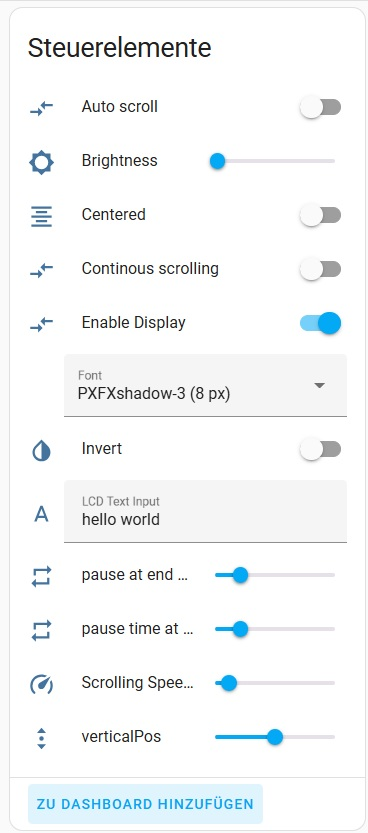


Use automations to update the display text based on events. For example, the following automation updates the display every minute:

```yaml
alias: Clock
description: ""
triggers:
  - trigger: time_pattern
    seconds: "0"
  - type: connected
    device_id: [YOUR DEVICE ID]
    entity_id: [YOUR ENTITY ID]
    domain: binary_sensor
    trigger: device
conditions: []
actions:
  - action: text.set_value
    metadata: {}
    data:
      value: "{{now().strftime('%H:%M')}}"
    target:
      entity_id: text.matrix_display_text_input
mode: single
```


### Solar production control panel for home assistant

This example displays solar production data and the state of your home energy management system (HEMS).

Features:
- Displays battery state of charge (SOC) as an icon.
- Shows whether energy is being imported or exported to the grid.
- Displays current solar production in kW.

```yaml
alias: Display solar production
description: ""
triggers:
  - entity_id: sensor.inverter_input_power
    trigger: state
  - entity_id: sensor.battery_state_of_capacity
    trigger: state
  - entity_id: sensor.power_meter_active_power
    trigger: state
  - type: connected
    device_id: [YOUR DEVICE ID]
    entity_id: [YOUR ENTITY ID]
    domain: binary_sensor
    trigger: device
conditions: []
actions:
  - variables:
      power_kw: >-
        {{ (states('sensor.inverter_input_power') | float(0) / 1000) | round(1)
        }}
      power_kw_s: |-
        
          {{ power_kw | round(1) | string }}k
        
          {{ power_kw | string | replace("0.", ".") }}k
        
          -k
        
      active_power: "{{ states('sensor.power_meter_active_power') | int(0) }}"
      battery_level: "{{ states('sensor.battery_state_of_capacity') | int(0) }}"
      battery_power: "{{ states('sensor.battery_charge_discharge_power') | float(0) }}"
      mdi_icon: |-

        
          {{ "\U000F0F9C" }}
          {# mdi:home-import-outline (exporting to grid) #}

        
          {{ "\U000F0D3E" }}
          {# mdi:import (importing from grid) #}

        

          
            
              {{ "\U000F089F" }}
            
              {{ "\U000F089C" }}
            
              {{ "\U000F0086" }}
            
              {{ "\U000F0087" }}
            
              {{ "\U000F0088" }}
            
              {{ "\U000F089D" }}
            
              {{ "\U000F0089" }}
            
              {{ "\U000F089E" }}
            
              {{ "\U000F008A" }}
            
              {{ "\U000F008B" }}
            
              {{ "\U000F0085" }}
            


          
          

            
              {{ "\U000F008E" }}
            
              {{ "\U000F007A" }}
            
              {{ "\U000F007B" }}
            
              {{ "\U000F007C" }}
            
              {{ "\U000F007D" }}
            
              {{ "\U000F007E" }}
            
              {{ "\U000F007F" }}
            
              {{ "\U000F0080" }}
            
              {{ "\U000F0081" }}
            
              {{ "\U000F0082" }}
            
              {{ "\U000F0079" }}
            


          

        
  - if:
      - condition: template
        value_template: "{{ active_power > 50 }}"
    then:
      - action: text.set_value
        metadata: {}
        data:
          value: "{{ mdi_icon }} {{ power_kw_s }}"
        target:
          entity_id: text.matrix_display_text_input
    else:
      - action: text.set_value
        metadata: {}
        data:
          value: "{{ mdi_icon }} {{ power_kw_s }}"
        target:
          entity_id: text.matrix_display_text_input
mode: single
```


## Acknowledgements
- MD_Parola library by MajicDesigns
- home assistant
- ESP home


## Development

Contributions are welcome.  
See `CONTRIBUTING.md` for details and follow the `CODE_OF_CONDUCT.md` when contributing.

All .stl, .png, and assembly pictures are automatically exported via my Fusion add-in, see [here](https://github.com/smengerl/fusion-exporter)

## License

This project is licensed under the Beerware License — see `LICENSE.txt` for details.

## Authors

- Simon Gerlach <https://github.com/Smenger>

---

If something in this README is missing or unclear, please open an issue in the repository so the instructions can be improved.
