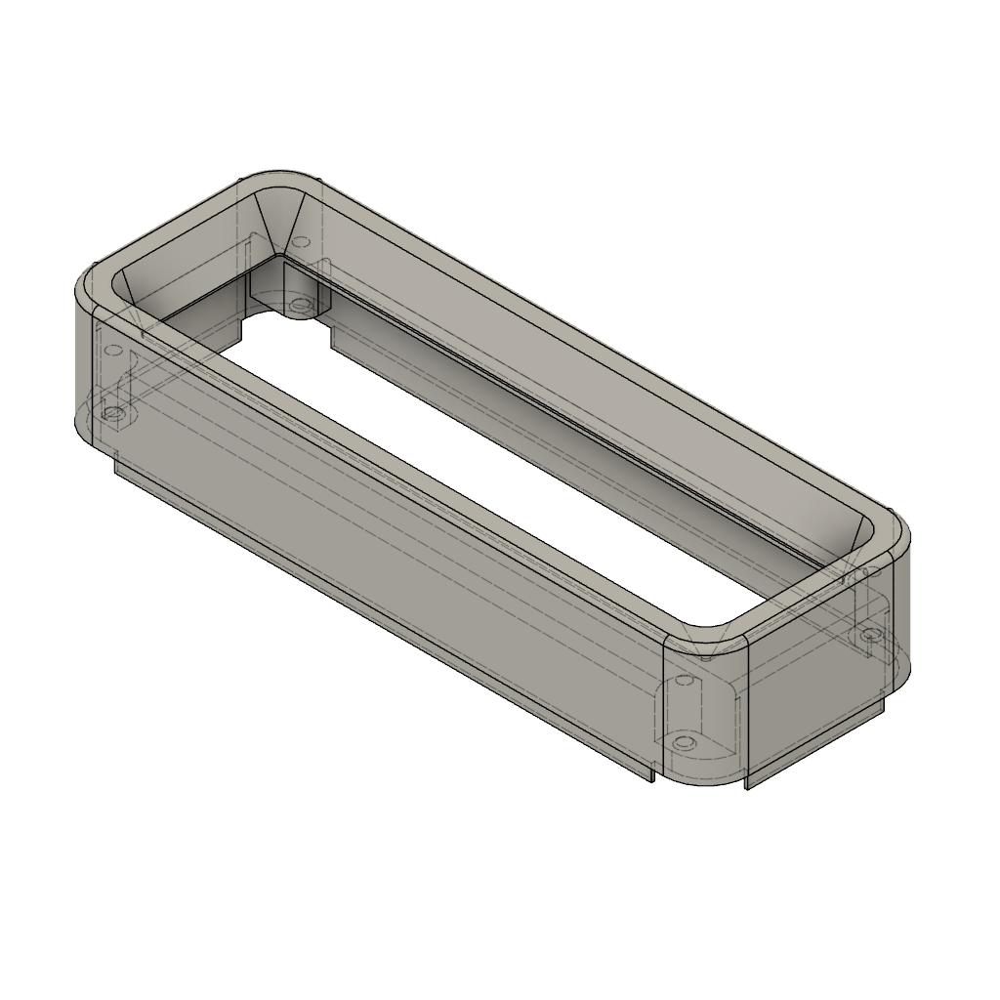
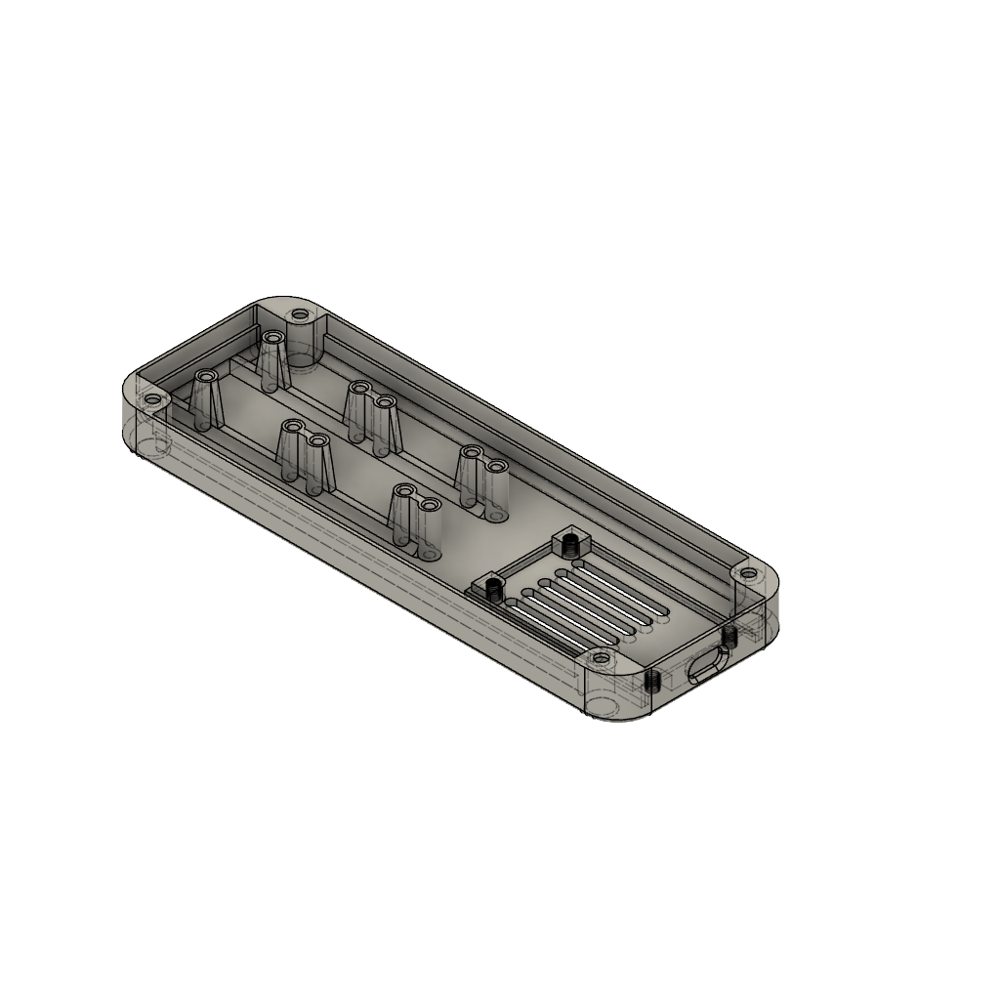

# Multi-purpose low-cost matrix display

Build on a budget of 10 USD, this 32*8 pixel LED matrix display using an ESP32 is suitable for various applications such as clocks or smart home displays.
All mechanical and eletrical resources are provided to build it from scratch with nothing but 3D printed parts and standard electronics. 
Full source code for some example use cases is provided.

Example use cases:
| Clock with NTP sync | Solar production panel for home assistant |
| ------------------- | ------------------------------------------------- |
|||
| Standalone clock with matrix LED display with automatic NTP time sync.<BR/><BR/><p>- Displays the current time in HH:MM format</p><p>- Customizable animations and dimming</p><p>- Automatic time synchronization using NTP</p> | Multi-purpose home assistant display for various usecases, demonstrated by showing current solar production and HEMS state.<BR/><BR/><P>- home assistant integration via ESP home</p><p>- Displaying arbitratry text</p><p>- Configurable parameters such as different fonts</p><p>- integration in home assistant automation capabilities</p> |
| [Go to Example](#clock-with-ntp-sync) | [Go to Example](#solar-production-control-panel-for-home-assistant) |


By using different filament colors, LED panels and by using or leaving out the acrylic plate, a lot of different styles can be build:


# Index
- [Mechanics](#Mechanics)
- [Electronics](#Electronics)
- [Usage: Clock with NTP sync](#clock-with-ntp-sync)
- [Usage: Generic home assistant display](#generic-home-assistant-display)
- [Usage: Solar production control panel for home assistant](#solar-production-control-panel-for-home-assistant)
- [Acknowledgements](#Acknowledgements)

## Mechanics

Renderings / Prototype:
| Front                                                | Back                                                 | Isometric |
| ---------------------------------------------------- | ---------------------------------------------------- | --------- |
|  |    |  |
|  |    |  |


The only mechanical part required is the housing which consists of a front and a back piece.
Using the acrylic plate on top of the LED matrix display is optional but gives a cleaner look (not used in the example photos)

### 3D-Printed Parts

| Filename                     | Thumbnail                                                                | Required | Notes |
| ---------------------------- | -------------------------------------------------------------------------| -------- | ------|
| `./print/frontside.stl`      |  | 1        | |
| `./print/backside.stl`       |    | 1        | |

Printer settings:
- All printed parts designed for PETG. 
- Best experience on my printer was to print the front upside down (the actual front of the case facing the print bed) as this does not require any supports. For a cleaner look you can consider to print it reversed with ironing enabled but note that this requires a lot of support material. 
- Using fuzzy skin for all outside walls creates a nice touch
- No rafts/brim etc. reguired for any model.

### Required parts

| Name              | Spec                          | Required | Notes |
| ----------------- | ----------------------------- | -------- | ------|
| countersunk screw | M3 5mm, e.g. DIN EN ISO 4762  | 4        | To attach ESP to back of housing |
| countersunk screw | M3 5mm, e.g. DIN EN ISO 4762  | 4        | To attach display to back of housing |
| cylinder head screw | M3 10mm | 4        | To fix back and front of housing |
| semi-transparent acrylic board | max 2mm, 140-150mm * 33-35mm | 1        | Optional, for cleaner look |

### Assembly

- All electronics are screwed to the back of the housing.
- The acrylic plate is glued to the front.
- Finally the front of the housing is snapped into the back and tightened via the screws from the back.
- Consider using some hot glue to make sure everything stays in place


## Electronics

### Part list

| Unit price | Quantity | Partname                   | Example   | Notes |
| ---------- | -------- | -------------------------- | --------- | ----- |
| 5 USD      | 1        | ESP32 Dev module           | <a href="https://de.aliexpress.com/item/1005006474308440.html">AliExpress</a> | USB-C Version |
| 3 USD      | 1        | 4 digit 8x8 LED matrix display based on MAX7219 (FC16) | <a href="https://de.aliexpress.com/item/1005006976020684.html">AliExpress</a> |  |

Total cost under 10 USD!


### Schematics


## Usage

The display can be used with different software and for various applications from which I will showcase some here.  

### Clock with NTP sync

This straightforward example is based on PIO and comes as a standalone application using some standard libraries. After being configured to connect to your WiFi, it will get current time from NTP servers and then continously show the current time.

#### Prerequisites

- PlatformIO
- MD_Parola (via PIO)
- ESPDateTime (via PIO) 
- WiFiManager (via PIO)

#### Installation

1. Clone the repository:
   ```sh
   git clone https://github.com/smengerl/Matrix_Clock.git
2. Open the project in PlatformIO.
3. Wait for PIO to configure and download the required libraries
4. Compile and upload the project to your ESP32 microcontroller.

#### Usage
- Power on the ESP32.
- On first usage only: Configure the ESP to your local WiFi. For this, connect to the ESP's access point and use the default configuration page to enter your WLAN SSID and password 
- Wait for NTP sync
- The current time will be displayed on the LED matrix.


### Generic home assistant display

In order to tie in to home assistant, we build on ESP home. Integration is basically just following the steps required for ESP home as for any device plus replacing the yaml configuration for code generation.

#### Prerequisites

- home assistant
- ESP home

#### Installation

1. Register the ESP to ESP home (e.g. via adopting the device via ESP home web)
2. Rename the device to matrix-display (so that `matrix-display.yaml` is the .yaml of your ESP home configuration for the device)
3. Copy the contents of [./ha_scripts](././ha_scripts) to the folder `[homeassistant]/config/esphome`, replacing `matrix-display.yaml`
4. Make sure to download the fonts you want to use and put the .ttf files in the fonts subfolder. I got mine from https://www.1001fonts.com/pixel-fonts.html. Due to unclear licenses, I'm not sharing them here but you should not have any issue finding them by the name in the code on that page. If you want other fonts, you should have no issues adapting the code as all is in fonts.yaml and font_helper.h.
5. Tailor `fonts.yaml`, if you want to use further material-design icons than the one I had added as an example 
6. Finally open `matrix-display.yaml` in ESP home and install update to device
7. After the new software is installed, your home assistant should have discovered a new device. Set up the device giving it a name (in the following I assume you called it again matrix_display) and you are ready to go. 


#### Usage

- In the device list of your home assistant, you should find the device in the ESP home integration
- Opening the device, you should see a control panel for the display as the one below 
- All values can now be tied to automations to write to the display (e.g. when a value changes, which you want to be displayed, then have an automation update the display text). An exanple of that is explained in the next usecase

Control panel as shown in device list of home assistant:


Lets use a clock as a bare-minimum example of the display's usage. The following automation is sending an updated text every minute to the display:

```yaml
alias: Clock
description: ""
triggers:
  - trigger: time_pattern
    seconds: "0"
  - type: connected
    device_id: [YOUR DEVICE ID]
    entity_id: [YOUR ENTITY ID]
    domain: binary_sensor
    trigger: device
conditions: []
actions:
  - action: text.set_value
    metadata: {}
    data:
      value: "{{now().strftime('%H:%M')}}"
    target:
      entity_id: text.matrix_display_text_input
mode: single
```


### Solar production control panel for home assistant

A little more advanced example would be a display of current solar production and the state of the home energy management system.
- Displaying icon for home battery SOC
- Whether energy is fed from grid or taken from grid
- Current solar production (kW) 

All the necessary preconditions such as the material design icons are already foreseen in the .yaml files if you haven't modified them.
All you need to do is to add another automation. This is the one I use (using a Huawei solar system in home assistant)

```yaml
alias: Display solar production
description: ""
triggers:
  - entity_id: sensor.inverter_input_power
    trigger: state
  - entity_id: sensor.battery_state_of_capacity
    trigger: state
  - entity_id: sensor.power_meter_active_power
    trigger: state
  - type: connected
    device_id: [YOUR DEVICE ID]
    entity_id: [YOUR ENTITY ID]
    domain: binary_sensor
    trigger: device
conditions: []
actions:
  - variables:
      power_kw: >-
        {{ (states('sensor.inverter_input_power') | float(0) / 1000) | round(1)
        }}
      power_kw_s: |-
        
          {{ power_kw | round(1) | string }}k
        
          {{ power_kw | string | replace("0.", ".") }}k
        
          -k
        
      active_power: "{{ states('sensor.power_meter_active_power') | int(0) }}"
      battery_level: "{{ states('sensor.battery_state_of_capacity') | int(0) }}"
      battery_power: "{{ states('sensor.battery_charge_discharge_power') | float(0) }}"
      mdi_icon: |-

        
          {{ "\U000F0F9C" }}
          {# mdi:home-import-outline (exporting to grid) #}

        
          {{ "\U000F0D3E" }}
          {# mdi:import (importing from grid) #}

        

          
            
              {{ "\U000F089F" }}
            
              {{ "\U000F089C" }}
            
              {{ "\U000F0086" }}
            
              {{ "\U000F0087" }}
            
              {{ "\U000F0088" }}
            
              {{ "\U000F089D" }}
            
              {{ "\U000F0089" }}
            
              {{ "\U000F089E" }}
            
              {{ "\U000F008A" }}
            
              {{ "\U000F008B" }}
            
              {{ "\U000F0085" }}
            


          
          

            
              {{ "\U000F008E" }}
            
              {{ "\U000F007A" }}
            
              {{ "\U000F007B" }}
            
              {{ "\U000F007C" }}
            
              {{ "\U000F007D" }}
            
              {{ "\U000F007E" }}
            
              {{ "\U000F007F" }}
            
              {{ "\U000F0080" }}
            
              {{ "\U000F0081" }}
            
              {{ "\U000F0082" }}
            
              {{ "\U000F0079" }}
            


          

        
  - if:
      - condition: template
        value_template: "{{ active_power > 50 }}"
    then:
      - action: text.set_value
        metadata: {}
        data:
          value: "{{ mdi_icon }} {{ power_kw_s }}"
        target:
          entity_id: text.matrix_display_text_input
    else:
      - action: text.set_value
        metadata: {}
        data:
          value: "{{ mdi_icon }} {{ power_kw_s }}"
        target:
          entity_id: text.matrix_display_text_input
mode: single
```


## Acknowledgements
- MD_Parola library by MajicDesigns
- home assistant
- ESP home
